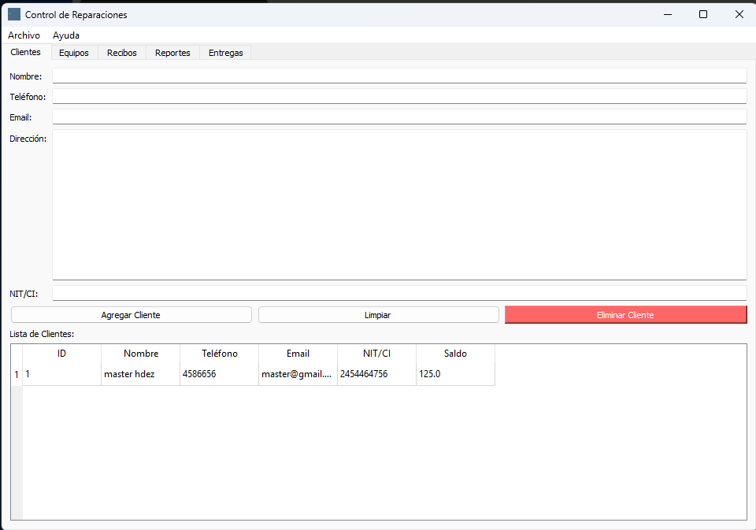

# reparaciones


<H3>Instalacion de python y pip</H3>

# 1
```bash
https://www.python.org/downloads/windows/
```
## Esto desde CMD
# 2
```bash
pip install fpdf2
```
# 3
```bash
pip install qrcode
```
# 4
```bash
pip install  PyQt5
```
# 5
```bash
pip install  python-dateutil
```
# 6
```bash
pip install Pillow
```
# 7
```bash
pip install XlsxWriter
```
## Correr el programa taller.py solo deslizalo al CMD
```bash
C:\Users\ezequ\Downloads\taller3\taller3\taller3.py
```
